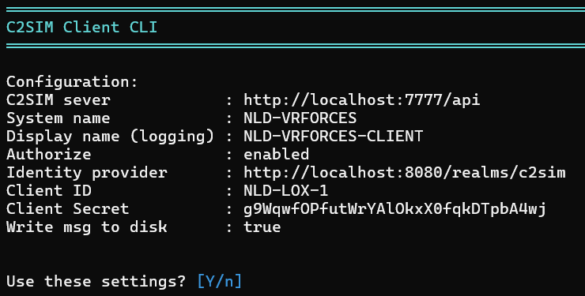
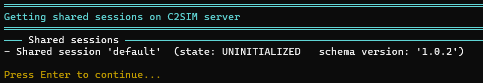
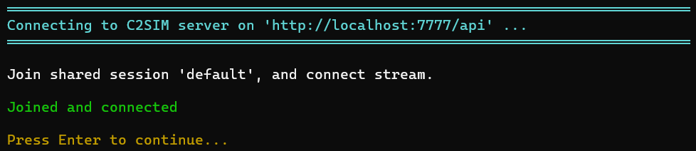
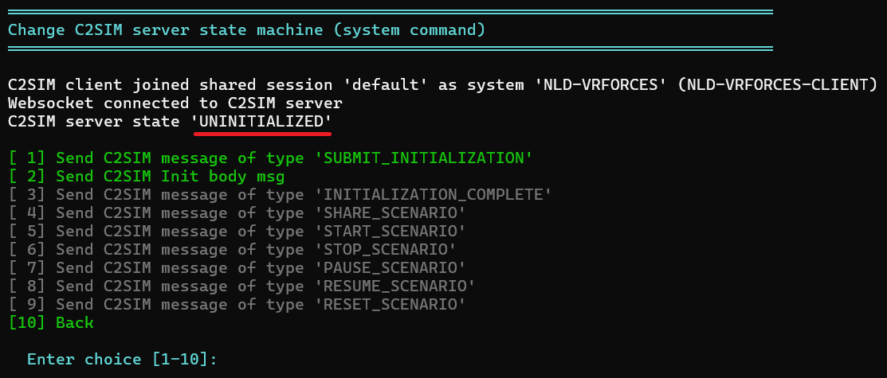
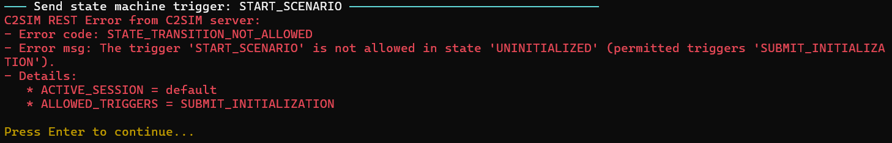
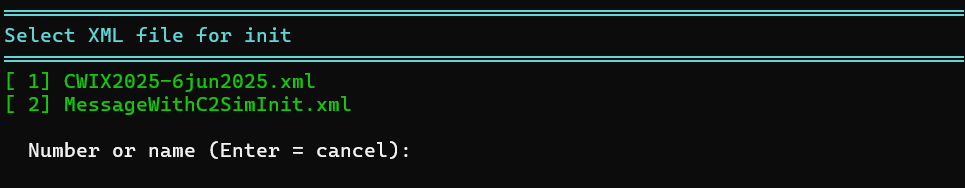
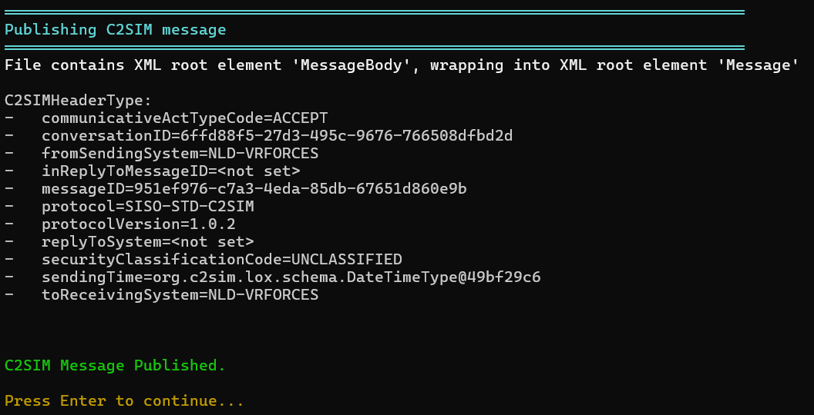
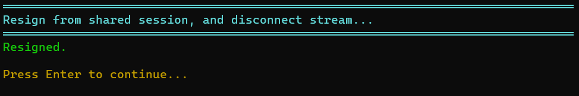
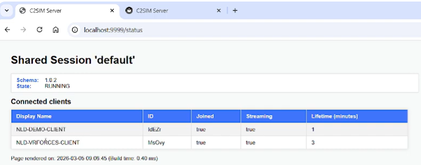

# C2SIM client CLI

The **C2SIM Client Command Line Interface (CLI)** is a lightweight tool used to test and interact with a **C2SIM Server**.

A small demo of the tool can be found [here](https://www.youtube.com/watch?v=NgBgH0__rlI)

The CLI uses the **C2SIM Client Library**, which implements the **Open API C2SIM Specification**.

!!! note

    The C2SIM Client CLI is intended only as a development and testing tool.

## Functionality

The CLI supports the following features:

- Display all active shared sessions on the C2SIM server

- Create a shared session on the C2SIM server

- Control the C2SIM server **state machine flow**

- Establish a **streaming connection (SSE)** to the C2SIM server

- Receive C2SIM messages and store them on disk

- Send C2SIM messages from disk (with or without a C2SIM header)

- Support **OIDC authorization**

- Display detailed **REST error responses**

- Validate messages using **XSD schemas**

- Store and load the **last-known configuration**

- 

## Build and run C2SIM-CLIENT-CLI

### Build

Navigate to the `c2sim-client-cli` directory and run:

```
mvn package
```

### Run

After building, run the application:

```
cd c2sim-client-cli\target\dist
java -jar c2sim-client-cli-1.0.0.jar
```

## How to use

When the application starts, it checks whether a `config.json` file exists.

- If the file exists, the configuration will be loaded.

- If it does not exist, the CLI will use **default hardcoded values**.



!!! note

    Menu options are displayed in green or gray:
    
    Green → Option is valid in the current context
    
    Gray → Option is not valid but can still be executed
    
    Gray options are intentionally executable to allow fault behaviour testing.## Change configuration

Configuration values are displayed in **cyan**, indicating the current value.

Press **Enter** to keep the current value.

| Config item                 | Description                                                                                                   |
| --------------------------- | ------------------------------------------------------------------------------------------------------------- |
| C2SIM Server url            | Endpoint of the C2SIM server implementing the Open API C2SIM specification                                    |
| System name                 | The system name referenced in the C2SIMInitializationBody                                                     |
| Default shared session name | Default shared session used by the CLI (can be changed later)                                                 |
| Display name                | The CLI generates a unique client ID, but this value is used for human-readable identification in server logs |
| Authorize                   | Enables authentication (see Authorization section)                                                            |
| Write to disk               | Stores received C2SIM messages on disk                                                                        |

The configuration is saved in **`config.json`** and reused the next time the CLI starts.

## Authorization

The **C2SIM Client CLI** supports **OIDC Client Credentials Flow**.

This flow is typically used for **machine-to-machine authentication**, but it can also support scenarios where a **human is involved in the authentication process**.

!!! note

    The CLI includes a default configuration for a local Identity Provider (Keycloak).
    
    This Keycloak instance is automatically started via Docker Compose and is preconfigured for the C2SIM server.## Show active shared sessions

## Show active shared session

The option **“Show shared sessions on C2SIM server”** retrieves the list of **active shared sessions**.



The **default shared session** is always present on the C2SIM server.

## Joining shared session

With option `Change shared session name` the shared session can be changed to join an other session. If the `Shared Session name` doesn't exist on the server, the C2SIM Client CLI will create the new `shared session`. The CLI will also request the streaming endpoint for the `shared session` and create a streaming connection (SSE).

Use option `Join shared session on C2SIM server (and setup stream)`:



## Change state machine

The option `Change C2SIM server state machine (system command)` allows the user to change the **state of the C2SIM server**. The required C2SIM message is **generated dynamically** by the CLI.  This is equivalent to sending a file containing a **C2SIM system command message**.



If another client changes the server state, the update will be visible via the option `Show Event Log`.

## Error handling

If the C2SIM server cannot process a request, it returns a **HTTP 400 Bad Request** response.

The CLI displays the **JSON error message returned by the server**.

In this example the `START_SCENARIO` C2SIM message is send, but the C2SIM server state is `UNINITIALIZED`, and this is not allowed.



## Load initialization data

The option `Send C2SIM Init body msg` can be used to send the initialization file. 

The initialization files can be found in the folder `c2sim_messages\init` (on disk).



## Sending C2SIM messages

In the main menu the option `Send C2SIM message` can be used to send C2SIM messages. 

The C2SIM messages can be found in the folder `c2sim_messages`. 

!!! note

    The C2SIM server requires the root element to be Message.
    
    Some files may use MessageBody as the root element (without a C2SIM header).
    The CLI will automatically wrap these messages inside a Message root element.



## Resign from shared session

The `C2SIM Client CLI` must resign from a shared session with `Resign from shared session (disconnect stream)`. Even if the **stream connection is lost**, the C2SIM server keeps the session alive for the client. When the client reconnects, it can **resume the session without rejoining**.



# C2SIM Server interface

The C2SIM Server page `/status`  shows:

- Active **shared sessions**

- Connected **clients**


