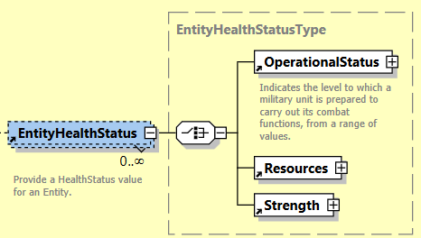
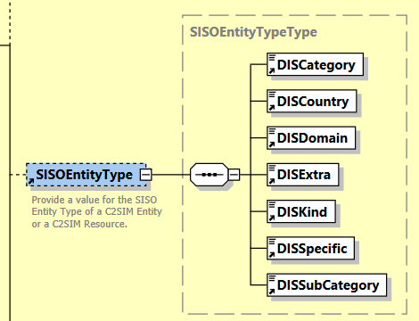
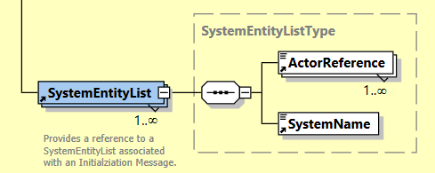
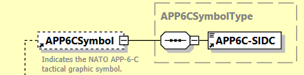
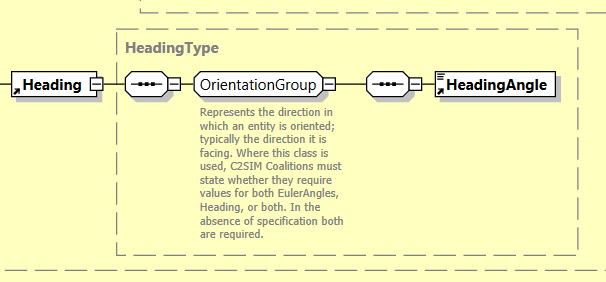

# C2SIM message known issues

## Health status

Have separate fields: `OperationalStatus`, `Resources`, `status` (not in the EntityHealthStatus list)

## Entity type complexity

Using a string with `dotted` notation would reduce number of XML tags (and thereby reducing file size). For example `1.2.153.2.1.2.0`

## System has no UUID

## App6

Most entities have `APP6` symbol, but when code is generated there is not generic way get get symbol value from each entity type.

## Indirect types

Lots of type have indirection, this add extra `xml tag` and extra null pointer checking.

