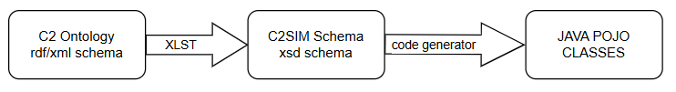

# C2SIM Message

The C2SIM standard defined the RDF schema with the C2SIM ontology. This schema is converted to an XSD schema (with XLST transformation). From this XSD schema JAVA classes are generated (JAXB).

The root element is `Message` (of type `MessageType`)

The `message` has two elements at root level:

| XML element | Description                                                                                  |
| ----------- | -------------------------------------------------------------------------------------------- |
| C2SIMHeader | Administrative information about the message. Used for authorization, routing and filtering. |
| MessageBody | The payload containing the actual content of the C2SIM message.                              |

## Schema version

Each `C2SIM sxd schema` should have it own version namespace. However, due to publication error all XSD schema's have namespace `http://www.sisostds.org/schemas/C2SIM/1.1`. 

## C2SIM Header

The fields within the C2SIM header are under discussion. The C2SIM standard uses FIPA, but FIPA has become obsolete.

Example of XML header section:

## Message payload

Types of information:

- Scenario Initialization

- Organizational Structure (ORBAT)

- Orders (Tasking)

- Reporting
  
  - Position / Strength / Readiness
  
  - Resource status
  
  - Observations 
  
  - Task progress and completion status

## Message kind

The message types are divided  into 5 main categories:

| Category                 | Description                                     |
| ------------------------ | ----------------------------------------------- |
| C2SIMInitializationBody  | Scenario initialization (orbat structure, etc.) |
| DomainMessageBody        | Orders and reports                              |
| ObjectInitializationBody | Initialization of single systems                |
| SystemAcknowledgeBody    | N/A                                             |
| SystemMessageBody        | Command message                                 |

Each payload contains one message kind (root element). The enumeration type `C2SimMsgKind` in the package `org.c2sim.lox` is used to identify the message kind. This is based on existing xpath.

| Message kind enumeration         | XPath                                                                |
| -------------------------------- | -------------------------------------------------------------------- |
| C2SIM_INITIALIZATION             | /Message/MessageBody/C2SIMInitializationBody                         |
| OBJECT_INITIALIZATION            | /Message/MessageBody/ObjectInitializationBody                        |
| ORDER                            | /Message/MessageBody/DomainMessageBody/OrderBody                     |
| REPORT                           | /Message/MessageBody/DomainMessageBody/ReportBody                    |
| CHECKPOINT_RESTORE               | /Message/MessageBody/SystemMessageBody/CheckpointRestore             |
| START_SCENARIO                   | /Message/MessageBody/SystemMessageBody/StartScenario                 |
| STOP_SCENARIO                    | /Message/MessageBody/SystemMessageBody/StopScenario                  |
| RESUME_SCENARIO                  | /Message/MessageBody/SystemMessageBody/ResumeScenario                |
| RESET_SCENARIO                   | /Message/MessageBody/SystemMessageBody/ResetScenario                 |
| PAUSE_SCENARIO                   | /Message/MessageBody/SystemMessageBody/PauseScenario                 |
| SHARE_SCENARIO                   | /Message/MessageBody/SystemMessageBody/ShareScenario                 |
| SUBMIT_INITIALIZATION            | /Message/MessageBody/SystemMessageBody/SubmitInitialization          |
| INITIALIZATION_COMPLETE          | /Message/MessageBody/SystemMessageBody/InitializationComplete        |
| MAGIC_MOVE                       | /Message/MessageBody/SystemMessageBody/MagicMove                     |
| SET_SIMULATION_REALTIME_MULTIPLE | /Message/MessageBody/SystemMessageBody/SetSimulationRealtimeMultiple |
