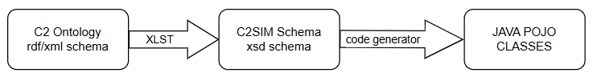
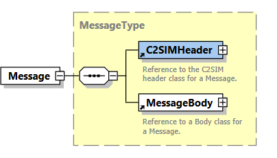
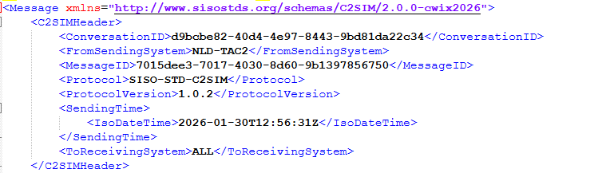

# C2SIM Message

The C2SIM data is defined the RDF schema with the C2SIM ontology. This schema is converted to an XSD schema (with XLST transformation). From this XSD schema JAVA classes are generated (JAXB).

The root element is `Message` (of type `MessageType`)

The `message` has two elements at root level:

| XML element | Description                                                                                  |
| ----------- | -------------------------------------------------------------------------------------------- |
| C2SIMHeader | Administrative information about the message. Used for authorization, routing and filtering. |
| MessageBody | The payload containing the actual content of the C2SIM message.                              |

## Schema version

The C2SIM server currently uses the C2SIM XSD schema with the namespace:

`http://www.sisostds.org/schemas/C2SIM/2.0.0-cwix2026` ([XSD file](https://github.com/TNO-MST/c2sim-server/blob/main/server/c2sim-land-operation-extension/src/main/resources/lox/xsd/2026/C2SIM_SMX_LOX_v2.0.0-cwix2026.xsd))

During startup, the C2SIM server logs the XSD version in use:

`The C2SIM server uses the LOX library, which was generated (JAXB) against the XSD namespace 'http://www.sisostds.org/schemas/C2SIM/2.0.0-cwix2026'.`

The C2SIM schema can be extended with custom XML elements and fields. However, the C2SIM Header and C2SIM Initialization messages are parsed and validated by the C2SIM server and therefore must conform exactly to the supported XSD schema.

The namespace

`http://www.sisostds.org/schemas/C2SIM/1.1`

is obsolete and should no longer be used. 

## C2SIM Header

The fields within the C2SIM header are under discussion. The C2SIM standard uses FIPA, but FIPA has become obsolete.

Example of XML header section:

## Message payload

Types of information:

- Scenario Initialization

- Organizational Structure (ORBAT)

- Orders (Tasking)

- Reporting
  
  - Position / Strength / Readiness
  
  - Resource status
  
  - Observations 
  
  - Task progress and completion status

## Message kind

The message types are divided  into 5 main categories:

| Category                 | Description                                     |
| ------------------------ | ----------------------------------------------- |
| C2SIMInitializationBody  | Scenario initialization (orbat structure, etc.) |
| DomainMessageBody        | Orders and reports                              |
| ObjectInitializationBody | Initialization of single systems                |
| SystemAcknowledgeBody    | N/A                                             |
| SystemMessageBody        | Command message                                 |

Each payload contains one message kind (root element). The enumeration type `C2SimMsgKind` in the package `org.c2sim.lox` is used to identify the message kind. This is based on existing `xpath`.

| Message kind enumeration         | XPath                                                                |
| -------------------------------- | -------------------------------------------------------------------- |
| C2SIM_INITIALIZATION             | /Message/MessageBody/C2SIMInitializationBody                         |
| OBJECT_INITIALIZATION            | /Message/MessageBody/ObjectInitializationBody                        |
| ORDER                            | /Message/MessageBody/DomainMessageBody/OrderBody                     |
| REPORT                           | /Message/MessageBody/DomainMessageBody/ReportBody                    |
| CHECKPOINT_RESTORE               | /Message/MessageBody/SystemMessageBody/CheckpointRestore             |
| START_SCENARIO                   | /Message/MessageBody/SystemMessageBody/StartScenario                 |
| STOP_SCENARIO                    | /Message/MessageBody/SystemMessageBody/StopScenario                  |
| RESUME_SCENARIO                  | /Message/MessageBody/SystemMessageBody/ResumeScenario                |
| RESET_SCENARIO                   | /Message/MessageBody/SystemMessageBody/ResetScenario                 |
| PAUSE_SCENARIO                   | /Message/MessageBody/SystemMessageBody/PauseScenario                 |
| SHARE_SCENARIO                   | /Message/MessageBody/SystemMessageBody/ShareScenario                 |
| SUBMIT_INITIALIZATION            | /Message/MessageBody/SystemMessageBody/SubmitInitialization          |
| INITIALIZATION_COMPLETE          | /Message/MessageBody/SystemMessageBody/InitializationComplete        |
| MAGIC_MOVE                       | /Message/MessageBody/SystemMessageBody/MagicMove                     |
| SET_SIMULATION_REALTIME_MULTIPLE | /Message/MessageBody/SystemMessageBody/SetSimulationRealtimeMultiple |
