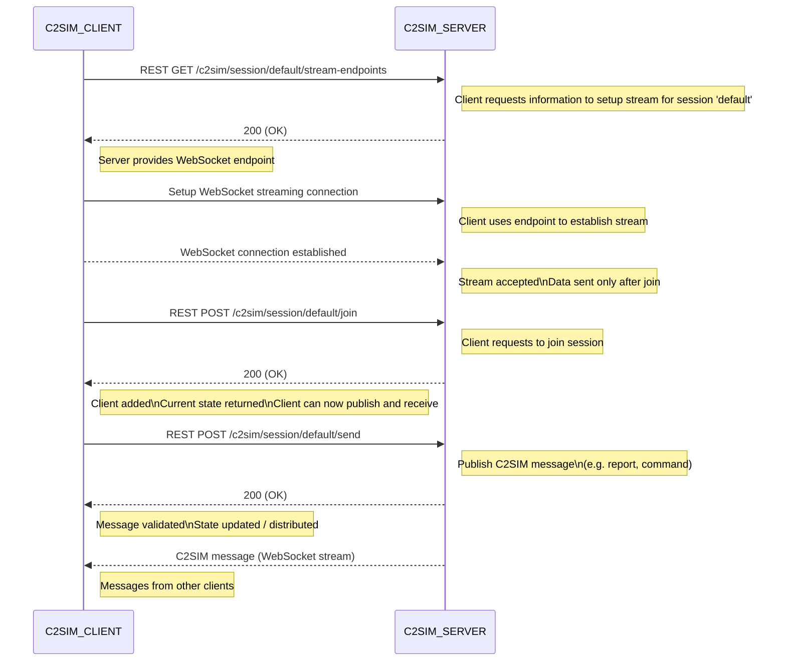

# C2SIM server implementation

The standards `SISO-STD-019-2020` and `SISO-STD-020-2020` only define `what` information must be available to make C2SIM system interoperable.  

The document `C2SIM Server Interface specification` describes the `how`.

## In a nutshell

`C2SIM clients` (systems) can connect to the `C2SIM Server` and join a `shared session`. Within this `shared sessions` the `C2SIM client` can receive and send `C2SIM Messages`. A `shared session` the `C2SIM clients` are sharing the same context (e.g. C2SIM schema version, C2SIm server state, .....). The `C2SIM server` can manage multiple `shared sessions` simultaneously. 

## Restful API

The communication between `C2SIM client` and `C2SIM server` is defined in [OpenAPI](https://www.openapis.org/) specification format.  

Advantages of OpenAPI are:

1. It provides a **clear and standardized description** of an API.

2. It allows **automatic generation of documentation**.

3. It enables **automatic code generation** for clients and servers.

4. It makes **API testing and validation easier**.

5. It helps ensure **consistency and accuracy** in API design.

The `C2SIM OpenAPI spec` can be viewed and tested [here]()

# Server side push (SSE)

One disadvantage of OpenAPI is that it is primarily designed for client-to-server request-response communication and does not directly support server-side push (SSE) mechanisms.  Therefore a server-side push mechanism was added to the C2SIm server implementation. The reference implementation uses a `WebSocket` to do server side push `C2SIM Messages` to the `C2SIM client`. This is SSE, therefore uni-directional communication (from server to client).

# Shared session

A `C2SIM client` can create a `shared session` trough a RESTful call. Or join an existing `shared session`. The reserved `shared session` named `default` is always available.

## Standard C2SIM client flow

