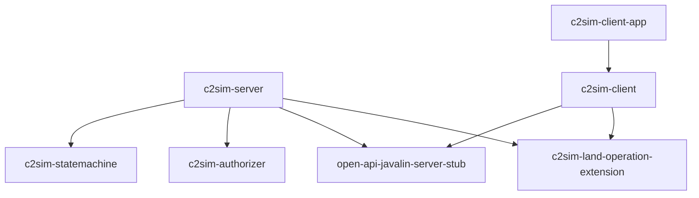

# C2SIM Architecture

## Project structure

```
root/
├── docker/                    # Build and deploy C2SIM server from docker
├── server/                    # C2SIM server implementation
├── docs/                      # mkdocs server documentation
├── open-api-spec/             # C2SIM Restful API specification
```

### C2SIM-Server Project structure

```
server/
├── c2sim-server/                    # C2SIM server 
├── c2sim-statemachine/              # C2SIM State machinelibrary
├── c2sim-authorizer/                # JWT/OIDC authorization
├── open-api-javalin-server-stub/    # Generated Kotlin stubs (OpenAPI)
├── c2sim-client/                    # Java C2SIM client library
├── c2sim-land-operation-extension/  # Generated C2SIM XML/JAXB bindings
└── c2sim-client-app/                # Example client application
```

## JAVA Modules

| Module                         | Description                                                                             |
| ------------------------------ | --------------------------------------------------------------------------------------- |
| c2sim-server                   | The C2SIM server implementation                                                         |
| c2sim-statemachine             | Library that handles the C2SIM state machine (logic can be used for client and server). |
| c2sim-client                   | JAVA Library with C2SIM Client to connect to C2SIM server.                              |
| open-api-javalin-server-stub   | Library with server generated stubs, based on OpenAPI spec.                             |
| c2sim-land-operation-extension | Helper functions for generated C2SIM XML code.                                          |

## Module Dependencies


