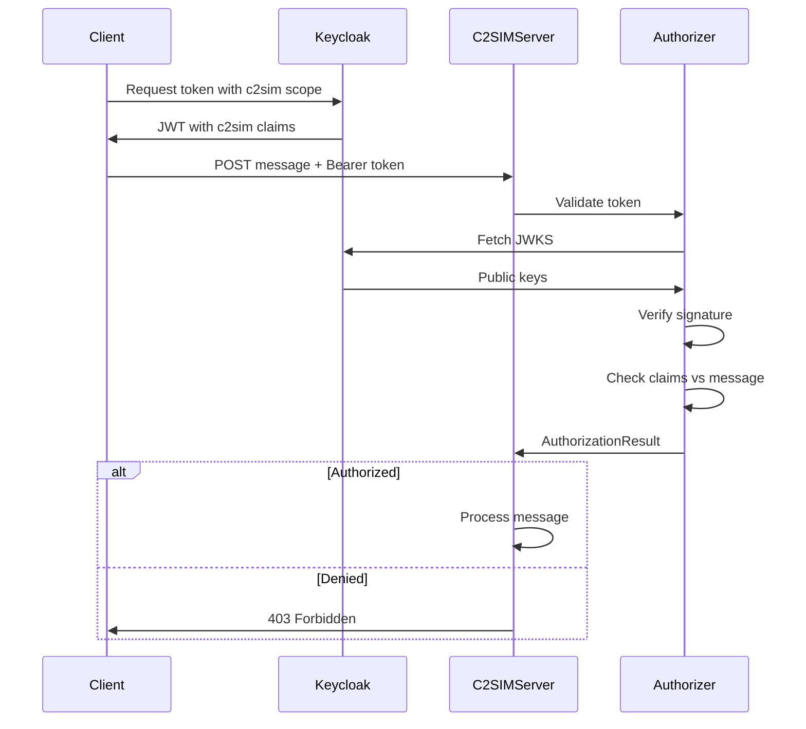

# Module C2SIM Authorization

This module handles all functionality for handling OpenID `C2SIM claims`. The `JWT token` signature is validated, `C2SIM claims` are extracted from `JWT payload`. And the claims can be validated against a `C2SIM message`.

More information over [OpenID C2SIM](../security/openid.md)

`C2SIM Server` uses `Autherizer` package to validate `JWT bearer token`:

