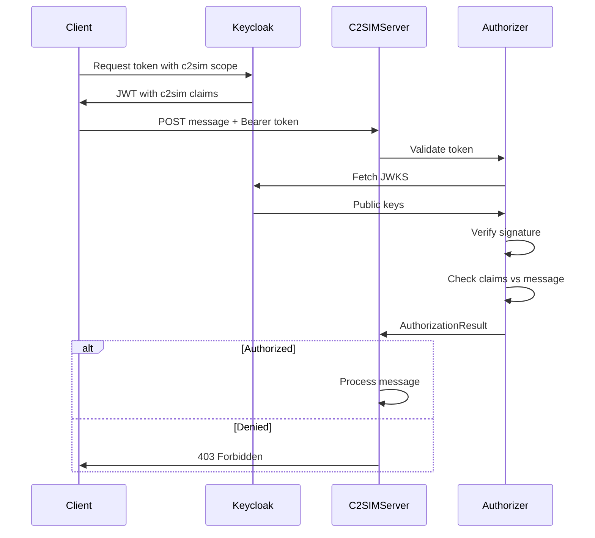

# Module C2SIM Authorization

This module handles all functionality for handling `OIDC C2SIM claims`. 

OpenID Connect (OIDC) is an identity layer built on top of OAuth 2.0. While OAuth 2.0 is designed for authorization (granting access to resources), OpenID Connect adds authentication. More information over [OpenID C2SIM](../security/openid.md)

The `JWT token` signature is validated, `C2SIM claims` are extracted from `JWT payload`. And the claims can be validated against a `C2SIM message`.

`C2SIM Server` uses `Autherizer` package to validate `JWT bearer token`:

```mermaid
sequenceDiagram
    participant Client
    participant Keycloak
    participant C2SIMServer
    participant Authorizer

    Client->>Keycloak: Request token with c2sim scope
    Keycloak->>Client: JWT with c2sim claims
    Client->>C2SIMServer: POST message + Bearer token
    C2SIMServer->>Authorizer: Validate token
    Authorizer->>Keycloak: Fetch JWKS
    Keycloak->>Authorizer: Public keys
    Authorizer->>Authorizer: Verify signature
    Authorizer->>Authorizer: Check claims vs message
    Authorizer->>C2SIMServer: AuthorizationResult
    alt Authorized
        C2SIMServer->>C2SIMServer: Process message
    else Denied
        C2SIMServer->>Client: 403 Forbidden
    end
```