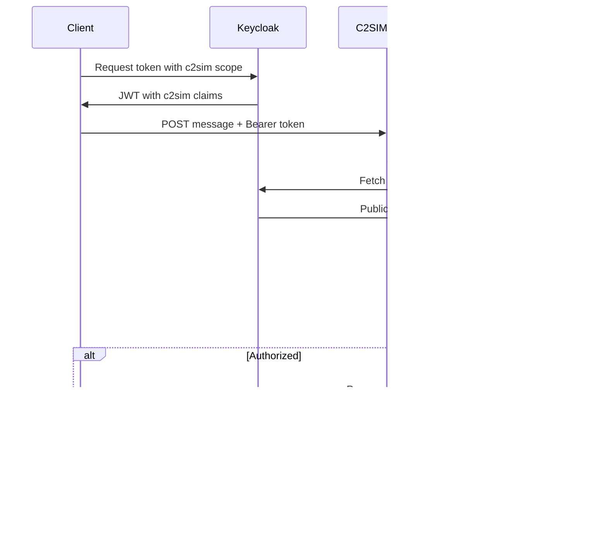

```mermaid
sequenceDiagram
    participant Client
    participant Keycloak
    participant C2SIMServer
    participant Authorizer

    Client->>Keycloak: Request token with c2sim scope
    Keycloak->>Client: JWT with c2sim claims
    Client->>C2SIMServer: POST message + Bearer token
    C2SIMServer->>Authorizer: Validate token
    Authorizer->>Keycloak: Fetch JWKS
    Keycloak->>Authorizer: Public keys
    Authorizer->>Authorizer: Verify signature
    Authorizer->>Authorizer: Check claims vs message
    Authorizer->>C2SIMServer: AuthorizationResult
    alt Authorized
        C2SIMServer->>C2SIMServer: Process message
    else Denied
        C2SIMServer->>Client: 403 Forbidden
    end
```