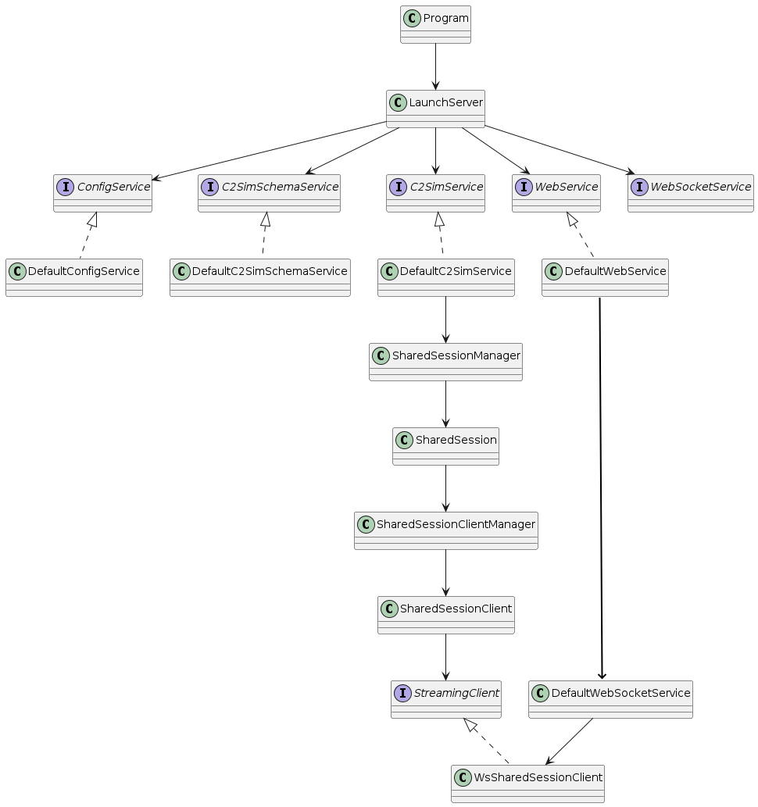
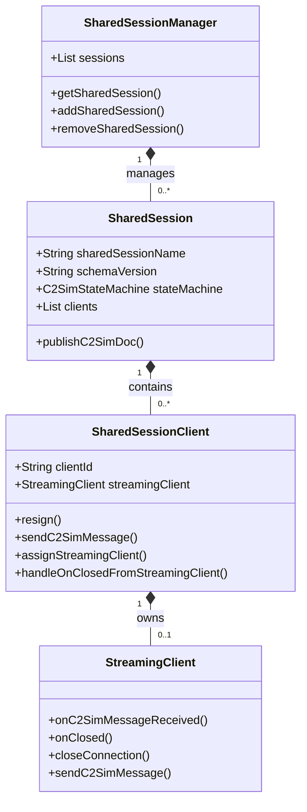

# Module C2SIM server

The `c2sim-server` module is the main application that provides REST and WebSocket endpoints for C2SIM message exchange. It uses **Javalin 6.7.0** (not Spring) as the web framework with Google Guice for dependency injection.

**Location**: `server/c2sim-server/`

**Key Characteristics**:

- OpenAPI-first REST API design
- WebSocket for real-time message streaming
- Prometheus metrics integration
- JWT-based authentication
- Swagger UI for API documentation

 

## High level UML view



## Service interfaces

| Service            |                                         |
| ------------------ | --------------------------------------- |
| ConfigService      | Manages all configuration-related data  |
| C2SimSchemaService | Validates C2SIM XSD schemas             |
| WebService         | Handles RESTful API operations          |
| WebSocketService   | Manages WebSocket communication         |
| C2SimService       | Oversees and coordinates C2SIM services |

## Management of Shared Sessions

Management of `Shared session clients` in the `Shared session`.  To keep it clear: the UML diagram doesn't contain all methods and methods arguments are left out.



## Application Entry Point

### LaunchServer

The application starts via the `LaunchServer` singleton:

**File**: `server/c2sim-server/src/main/java/org/c2sim/LaunchServer.java`

```java
public class LaunchServer {
    private final Injector injector;

    public LaunchServer() throws IOException {
        // 1. Create Guice injector
        this.injector = Guice.createInjector(new DefaultModule());

        // 2. Show license
        showLicense();

        // 3. Initialize default sessions
        initializeServer();
    }

    public void start() {
        // 4. Start Javalin web server
        getWebService().serve();

        // 5. Register WebSocket handlers
        getWebSocketService().register();
    }
}
```

**Startup sequence**:

1. Guice creates all singleton services
2. Configuration loaded from environment variables
3. Default shared sessions created from `server-config.json`
4. Javalin web server starts on configured port (default: 7777)
5. WebSocket endpoints registered

### Main Method

**File**: `server/c2sim-server/src/main/java/org/c2sim/Program.java`

```java
public class Program {
    public static void main(String[] args) {
        LaunchServer.getSingleton().start();
    }
}
```

## Dependency Injection Setup

### DefaultModule

**File**: `server/c2sim-server/src/main/java/org/c2sim/server/DefaultModule.java`

All services are bound as **singletons**:

```java
public class DefaultModule extends AbstractModule {
    @Override
    protected void configure() {
        bind(ConfigService.class).to(DefaultConfigService.class).in(Scopes.SINGLETON);
        bind(C2SimSchemaService.class).to(DefaultC2SimSchemaService.class).in(Scopes.SINGLETON);
        bind(C2SimService.class).to(DefaultC2SimService.class).in(Scopes.SINGLETON);
        bind(WebService.class).to(DefaultWebService.class).in(Scopes.SINGLETON);
        bind(WebSocketService.class).to(DefaultWebSocketService.class).in(Scopes.SINGLETON);
    }

    @Provides
    ObjectMapper provideObjectMapper() {
        return C2SimObjectMapper.mapper;
    }
}
```

**Convention**: All implementations use **constructor injection** - no field injection.

## RESTFul API implementation

The project uses an `OpenAPI-first REST API design` approach. In the module [open-api-javalin-server-stub](module-open-api-javalin-server-stub.md) , a server stub is automatically generated from the C2SIM OpenAPI specification.

in the package `org.c2sim.server.rest.impl` the RESTful server stub interfaces are implemented. 

The only exception is the **C2SIM initialization** operation.  This endpoint returns its response in **XML** format. Because the generated OpenAPI server stub does not support `application/xml` as a response type for this operation, the XML response is handled explicitly in: `DefaultWebService::handleSpecialCaseRestOperationInitialization`. 

## Configuration management

**File**: `server/c2sim-server/src/main/java/org/c2sim/server/utils/Config.java`

The class `DefaultConfigService` implements a type-safe configuration. If the `ENV variable` is set, this value is used, else the the default value is returned. 

The method `Config::asTable` can be used to print all available config options (with ENV name) to the console.
