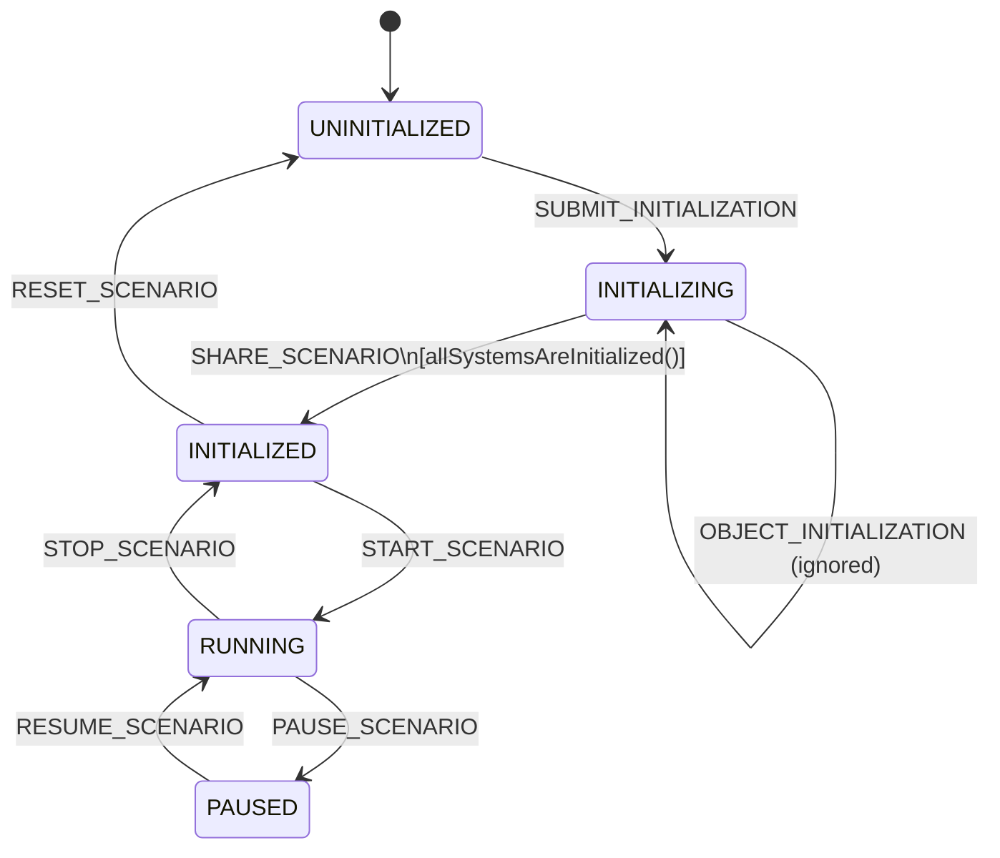

# Module C2SIM state machine

The C2SIM server uses a formal state machine to control and validate the lifecycle of shared sessions and related server operations.

The state machine is implemented using the library:

```
com.github.stateless4j
```

Stateless4j is a lightweight finite state machine (FSM) library for the JVM. It provides a clear and structured way to define:

- States

- Triggers (events)

- Transitions

- Entry and exit actions

Within the C2SIM server, the state machine is used to:

- Enforce valid transitions between C2SIM operational states

- Prevent illegal state changes

- Guarantee protocol compliance

- Centralize lifecycle logic in a deterministic and testable manner

By modeling the C2SIM control flow explicitly as a state machine, the server behavior becomes:

- Predictable

- Maintainable

- Easier to validate against the C2SIM standard

## Triggers

Transitions are driven by `Trigger` values, which correspond to C2SIM control messages such as:

- `SUBMIT_INITIALIZATION`

- `SHARE_SCENARIO`

- `START_SCENARIO`

- `STOP_SCENARIO`

- `PAUSE_SCENARIO`

- `RESUME_SCENARIO`

- `RESET_SCENARIO`

## Entry Callbacks

The `StateMachineListener` interface provides entry hooks:

- `onEnterStateUninitialized`

- `onEnterStateInitializing`

- `onEnterStateInitialized`

- `onEnterStateRunning`

- `onEnterStatePaused`

This allows the server to perform side effects during state transitions without coupling business logic directly to the state configuration.

## Mermaid

The method `C2SimStateMachine::toMermaid` can be used to generate an [mermaid  notation](https://mermaid.live/) to visualize the state machine.


