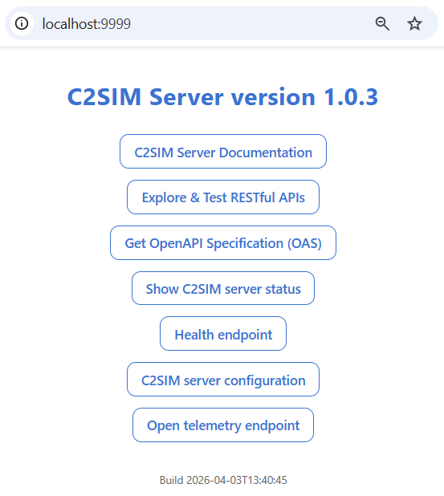

# Quick start C2SIM Server

There are several options to deploy the C2SIM server:

* Docker deployment - The fastest option, using a prebuilt Docker image.

* Build and run locally - Build the C2SIM server from source and run it locally.

## Prerequisites

**Deploy C2SIM locally**

| Tool       | Version | Purpose                      |
| ---------- | ------- | ---------------------------- |
| **Git**    | Latest  | Version control              |
| **Docker** | Latest  | Containerization and runtime |

**Required when building locally (without docker)**

| Tool         | Version                           | Purpose                      |
| ------------ | --------------------------------- | ---------------------------- |
| **Java JDK** | 21                                | Primary development language |
| **Maven**    | 3.8.7+                            | Build system                 |
| **IDE**      | IntelliJ IDEA / VS Code / eclipse | Development environment      |

## Fetch C2SIM project

Clone the repository from GitHub:

```bash
git clone https://github.com/TNO-MST/c2sim-server
```

### Deploy C2SIM-server with docker

When using Docker deployment, only the folder `<root>\docker` is required.

This setup starts the C2SIM server and its related services:

```bash
cd docker
docker compose up -d
```

See the [docker section](./../docker/docker.md) for more information.

## Build project locally

The folder `<root>\server` contains the multi module maven pom.xml 

```bash
cd server
mvn clean package
```

**Expected output**:

```
[INFO] ------------------------------------------------------------------------
[INFO] Reactor Summary:
[INFO]
[INFO] c2sim ............................................. SUCCESS [  0.5s]
[INFO] c2sim-statemachine ................................ SUCCESS [  2.1s]
[INFO] lox ............................................... SUCCESS [  3.2s]
[INFO] open-api-javalin-server-stub ...................... SUCCESS [  1.8s]
[INFO] c2sim-authorizer .................................. SUCCESS [  1.5s]
[INFO] c2sim-server ...................................... SUCCESS [  4.3s]
[INFO] c2sim-client ...................................... SUCCESS [  2.1s]
[INFO] c2sim-client-app .................................. SUCCESS [  0.8s]
[INFO] ------------------------------------------------------------------------
[INFO] BUILD SUCCESS
[INFO] ------------------------------------------------------------------------
```

The `<root>\server\target` should now contain the C2SIM server. When the `<root>\server\pom.xml` is imported into an IDE,  the C2SIM server can also be started (and debugged) within the IDE. 

To run the c2sim-server (from <root> folder):

```bash
mvn -pl c2sim-server exec:java
```

### Build Server Using Docker (from Source)

It is also possible to build the C2SIM server inside a Docker container. From the `<root>\docker` folder, run:

```bash
docker compose build c2sim-server
```

This will create/update the `docker image` locally with the latest build.

## C2SIM Server running, and now?

The `C2SIM server` exposes a simple management interface on the server root endpoint. 

The default endpoint :

| C2SIM-server deployment           | Website               |
| --------------------------------- | --------------------- |
| Internal (running from IDE)       | http://localhost:7777 |
| External (when running in docker) | http://localhost:9999 |



When `docker compose` was used to deploy the `C2SIM server` this [page](./../docker/docker.md) describes all endpoints. 

The [C2SIM CLI tool](./../c2sim-client-cli/c2sim-client-cli.md) can be used how to interact with the C2SIM server. 
