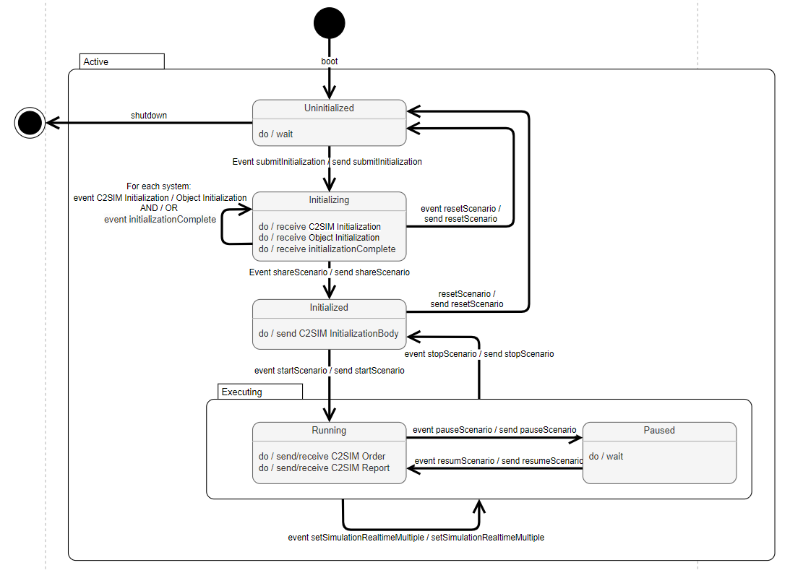

# C2SIM Server flow control

C2SIM clients can join a `shared session` on the C2SIM server. The C2SIM server can manage multiple `shared session` simultaneously. 

An orchestration is needed to keep all distributed `C2SIM clients` in a `shared session` in sync. For example: all `C2SIM clients` must start, stop and pause simultaneously.

The C2SIM servers uses a state machine to manage the control flow. Each `shared session` has one `state`.  It is up to the `C2SIM clients` to keep their state machine in sync with the C2SIM server `state` (`C2SIM Message` notifications of state change).

The following states are defined: 

| State         | Description                                                    |
| ------------- | -------------------------------------------------------------- |
| UNINITIALIZED | Server is starting                                             |
| INITIALIZING  | Waiting for scenario initialization                            |
| INITIALIZED   | Scenario initialization completed, waiting for (C2SIM) systems |
| RUNNING       | The scenario is running                                        |
| PAUSED        | The scenario is in paused state (no orders, reports allowed)   |

The `C2SIM clients` can send an `C2SIM Message` to trigger and event in the state machine. The C2SIM server validate the trigger, when it is a valid transition, the `state` is changed. A `C2SIM Message` is used to inform the `C2SIM clients` of the state change.

The following `C2SIM Message` are used for flow control:

* `SubmitInitialization`
- `InitializationComplete` (optional)

- `ShareScenario`

- `StartScenario`

- `PauseScenario`

- `ResumeScenario`

- `StopScenario`

- `ResetScenario`

The `C2SIMInitializationBody` is used to initialize scenario.

| Direction                    |                               |
| ---------------------------- | ----------------------------- |
| C2SIM client => C2SIM server | State transition trigger      |
| C2SIM server => C2SIM client | State transition notification |

## State machine diagram

