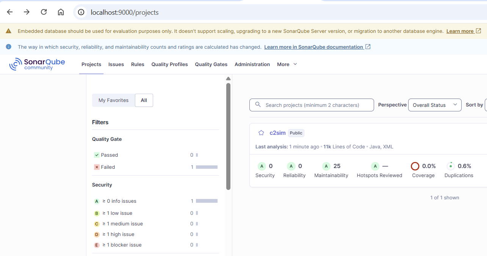

# SonarQube

**SonarQube** is a **code quality and security analysis platform** that scans the source code to detect:

- Bugs

- Security vulnerabilities

- Code smells

- Maintainability issues

-  Test coverage gaps

- Technical debt

More [information on SonarQube](https://www.sonarsource.com/products/sonarqube)

## Use SonarQube locally

To start the docker SonarQube server:

/docker/sonarqube

```bash
docker compose up -d
```

* Wait for SonarQube server to start up

* Open browser on `http://localhost:9000/` (unsecure website)

* Login with 'admin', 'admin'

* Change password

* Create new token (`My Account` => `Security tab` => `User token`) 

* Store the generated token (should start with `squ_`), this is needed for the `maven` command

!!! warning  

    The storage for SonarQube is persistent.  
    After changing the SonarQube admin password, it is saved in the persistent volume.  
    The next time SonarQube starts, you must use the **new password**, not the default.

## Run code analyses

From the `C2SIM-SERVER` root folder (with `pom.xml`) run:

```bash
mvn clean verify sonar:sonar \
  -Dsonar.host.url=http://localhost:9000 \
  -Dsonar.login=YOUR_TOKEN -DskipTests
```

!!! note

    The open `-Dskiptest` is used to speed the process up, but must not be used if `code covergage` is need.

## View analyses

Open the website `http://localhost:9000` and the `c2sim` project should be updated.


 

## Reset SonarQube

```
docker compose up -v
```
