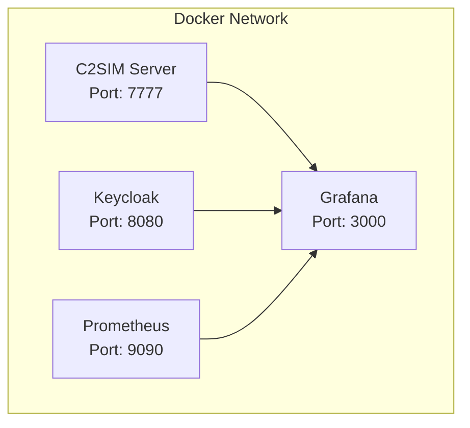

# Docker C2SIM development environment

The C2SIM Server is deployed using **Docker Compose** with supporting services (Keycloak, Prometheus, Grafana).  The docker compose can also be used to deploy the c2sim-server but also create a clean build from the source code. 

## Docker Compose Architecture



## Quick Start

### Build and Run All Services

```bash
cd docker

# Build from source code and run
docker compose up --build
# Run docker image directly (in background)
docker compose up -d
```


**Services started**:

|                      |                                     |                                                                                       |
| -------------------- | ----------------------------------- | ------------------------------------------------------------------------------------- |
| C2SIM Server         | http://localhost:7777               |                                                                                       |
| Keycloak             | http://localhost:8080               | Identity provider, initialized with test client credentials to test the c2sim claims. |
| Prometheus           | http://localhost:9090               | Collection of metric data                                                             |
| Grafana              | http://localhost:3000 (admin/admin) | Visualization of metric data                                                          |
| MkDocs Documentation | http://localhost:7778               | Access documentation from docker container                                            |

Note: keycloak, prometheus and grafana are meant for testing environments, **not production**

### Stop Services

```bash
docker-compose down
```

### Clean Restart (Remove volumes)

```bash
docker-compose down -v
docker-compose up --build
```

**Check logs**:

```bash
docker-compose logs c2sim-server
```
