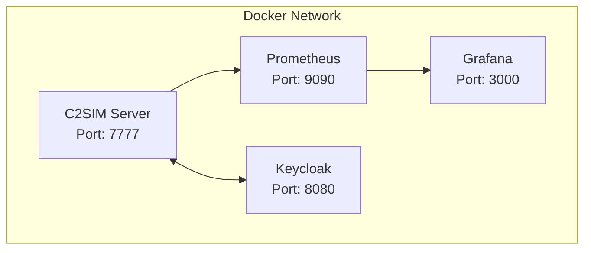

# Docker C2SIM development environment

The C2SIM Server is deployed using **Docker Compose** with supporting services (Keycloak, Prometheus, Grafana).  The docker compose can also be used to deploy the c2sim-server only, and create a clean build from the source code. 

!!! note

    The `supporting services` are only for testing, not production environment!

## Docker Compose Architecture


```mermaid
flowchart TB
    subgraph Docker_Network["Docker Network"]
        C2SIM["C2SIM Server<br/>Port: 7777"]
        KC["Keycloak<br/>Port: 8080"]
        PROM["Prometheus<br/>Port: 9090"]
        GRAF["Grafana<br/>Port: 3000"]

        C2SIM --> PROM
        C2SIM <--> KC
        PROM --> GRAF
    end
```

## Quick Start

### Start all Services

```bash
cd docker
# Run docker image directly (in background)
docker compose up -d

# Or only start C2SIM-server
docker compose up c2sim-server -d
```

**Services started**:

| Component            |                                                                                       |
| -------------------- | ------------------------------------------------------------------------------------- |
| C2SIM Server         | The C2SIM server                                                                      |
| Keycloak             | Identity provider, initialized with test client credentials to test the c2sim claims. |
| Prometheus           | Collection of metric data                                                             |
| Grafana              | Visualization of metric data                                                          |
| MkDocs Documentation | Access documentation from docker container                                            |

### Stop services

```bash
docker-compose down
```

### Clean restart (remove volumes)

```bash
docker-compose down -v
docker-compose up -d
```

## Check logs

```bash
docker-compose logs c2sim-server
```

## End points

Based on value in `docker/env` the default exposed port numbers:

| Name                     | URL                                                   |
| ------------------------ | ----------------------------------------------------- |
| C2SIM-server             | http://localhost:9999                                 |
| C2SIM API endpoints      | http://localhost:9999/api                             |
| Swagger UI (OpenApi)     | http://localhost:9999/openapi-ui.html                 |
| MkDocs Documentation     | http://localhost:9999/docs/                           |
| Grafana                  | http://localhost:3000 (admin with password `welcome`) |
| Metrics (open telemetry) | http://localhost:9999/metrics                         |
| Keycloak                 | http://localhost:8080 (admin with passsword `admin`)  |
| C2SIM Metric endpoint    | http://localhost:9999/metrics                         |
| C2SIM health endpoint    | http://localhost:9999/health                          |

## Building C2SIM server with docker

By default the `docker compose` will check if the docker image is local, if not the docker image will be pulled from the docker repository `docker.io`. 

It is also possible to build the C2SIM server from source code with a docker container. 

```
# Build C2SIM server docker container fresh from source code 
docker compose build
```
