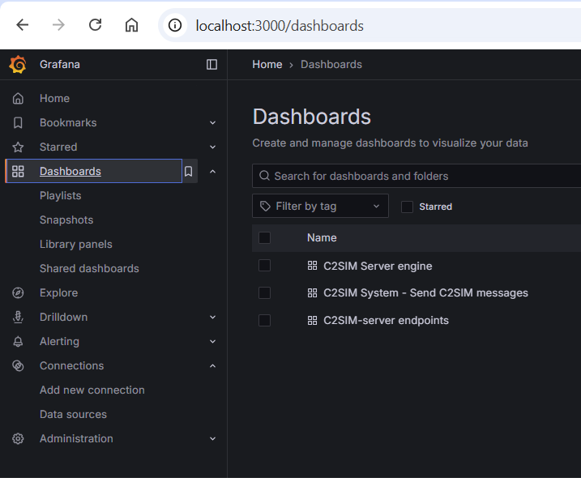

# C2SIM Metrics

The C2SIM server exposes a `/metrics` endpoint that publishes runtime metrics using the **[OpenTelemetry](https://opentelemetry.io/)** standard.

## Docker Test Environment

To support local development and metrics validation, the development Docker environment includes a complete observability stack.

Included Services

| System                               | Description                                                                                    |
| ------------------------------------ | ---------------------------------------------------------------------------------------------- |
| [Prometheus](https://prometheus.io/) | Open-source tool to scrapes the `/metrics` endpoint and stores time-series data in a database. |
| [Grafana](https://grafana.com/)      | Open-source visualization platform for exploring and displaying metric history                 |

This setup allows:

* Verify that metrics are correctly exposed by the C2SIM server

* Inspect real-time metric values

* Analyze historical trends

* Build dashboards for performance monitoring

Prometheus periodically collects metrics from the C2SIM `/metrics` endpoint, while Grafana provides a user-friendly web interface for querying and visualizing the collected data.

⚠ *Development Use Only*

This Docker setup is intended **for development and testing purposes only**.

## Configuration

In `docker\prometheus\prometheus.yml` is configured that [Prometheus](https://prometheus.io/) should scrape the endpoint `c2sim-server:7777` every `5 sec`.  Because the c2-sim server and Prometheus run the the same docker container this works with localhost and an internal port number. In `docker\grafana\provisioning\datasources\datasource.yml` a data source is created for Prometheus that uses Prometheus to query time serie-data. The Grafana dashboards are automatically loaded from the folder `grafana\provisioning\dashboards`.

## Using Grafana dashboard

When the `docker compose` is started, the monitoring tools are automatically started. Use 'http:\\\localhost:30001` to open `Grafana`:



By default the website is opened in `readonly` mode.  Login as `admin` to modify the configuration.

In the file `docker/.env` the following configuration items apply:

| Config entry    | Description                                    | default   |
| --------------- | ---------------------------------------------- | --------- |
| GRAFANA_PORT    | The external port number for Grafana dashboard | 3000      |
| PROMETHEUS_PORT | Don't change, is for docker internally         | 9090      |
| PASSWORD        | The password for `admin`on Grafana.            | federates |

## Javalin Micrometer plugin

The [Javalin Micrometer plugin](https://javalin.io/plugins/micrometer) is used to collect and expose application metrics. This plugin is built on top of the [Micrometer](https://micrometer.io/) framework, which is primarily focused on exposing metrics to monitoring systems.

For broader observability capabilities—including metrics, logs, and traces—the [OpenTelemetry](https://opentelemetry.io/docs/languages/java/intro/) framework is more suitable. OpenTelemetry provides a unified approach to collecting and exporting telemetry data across these domains.

The Javalin Micrometer plugin provides several metrics out of the box, such as Jetty server metrics, disk usage, processor statistics, and other system-level information. In addition to these built-in metrics, the `MetricService` class introduces custom C2SIM metrics specific to the application.. See [C2SIM metrics](generated-metrics.md)

In the future, it may be possible to combine both libraries, using Micrometer for certain metrics while integrating Open Telemetry for a more comprehensive observability solution.

## Metric datatype

In the Open Telemetry standard multiple datatypes for storing metric data are defined. The C2SIM server uses the following types:

| Type    | Description                                                                                         |
| ------- | --------------------------------------------------------------------------------------------------- |
| Counter | Is a metric that only increases over time (or resets to zero after a restart)                       |
| Gauge   | Represents a value that can go up or down at any time.                                              |
| History | A histogram measures the distribution of values by counting observations into configurable buckets. |

## Metric attributes

Each metric can have zero, or multiple attributes (sometimes referred as tags or labels). The combination of all attributes in a metric is stored as a data series. 

For the `C2SIM-server` the following attributes are added:

| Attribute (tag/label)                                              | Description                                                                                                               |
| ------------------------------------------------------------------ | ------------------------------------------------------------------------------------------------------------------------- |
| c2sim.app                                                          | Fixed to value `c2sim-server`                                                                                             |
| c2sim.shared_session                                               | The `shared session name` where the metric data was collected from.                                                       |
| c2sim.system_name                                                  | The `system name` of the system that is monitored.                                                                        |
| c2sim.msg_kind                                                     | The category of the `C2SIM message`                                                                                       |
| c2sim.request_endpoint, c2sim.request_method, c2sim.request_status | All `javalin` endpoints the duration of the request is measured for each combination of `method`, `endpoint` and `status` |
| c2sim.error_kind                                                   | The category why request failed.                                                                                          |

!!! warning

Keep number of possible attribute combination low, or it will impact the performance of the database.  For example: `c2sim.shared_session` (3 sessions) * `c2sim.system_name` (10 systems) * `c2sim.msg_kind` (5 categories) = 150 data series.  Below ** 1000 ** is a safe number of data series.

## Generate markdown from metric endpoint

The project [porm2json](https://github.com/prometheus/prom2json) can scrape a Prometheus client and dump the result as JSON. · With with linux tool [jq](https://jqlang.org/) this json can be converted to markdown notation.

```
docker run --rm \
  --add-host=host.docker.internal:host-gateway \
  prom/prom2json \
  http://host.docker.internal:9999/metrics \
| jq -r '
sort_by(.name)
| group_by(.name)[]
| .[0] as $m
| ([ .[].metrics[].labels? | keys[] ] | unique) as $labels
| "## Metric \"" + $m.name + "\"\n\n"
+ "**Type:** " + ($m.type|ascii_downcase) + "  \n"
+ "**Description:** " + ($m.help // "No description") + "\n"
+ (if ($labels|length)>0
   then "\n**Labels:** " + ($labels | join(", ")) + "\n"
   else ""
   end)
' > markdown.md
```
