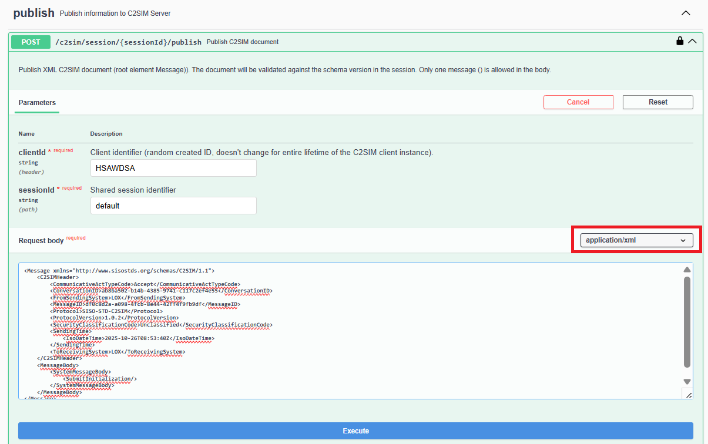
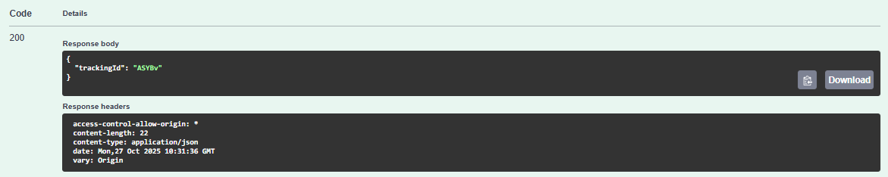

# Manual testing

This procedure is only to show how the interaction with the `C2SIM server` works. This is only for demonstration, applications will do the same, only then programmatically.

Open on the C2SIM-SERVER the path `openapi-ui.html`. This page can be used to simulate REST call.

## Joining the C2SIM server

First we need to register at the C2SIM server, expand the `join` section:

Click `Try it out` button and fill in the information for the request:

* clientId: `HSAWDSA` (or any combination of letters)

* sessionId: `default` (this shared session is always available on C2SIM-SERVER)

* systemName: `NLD_LOX` (or any system name)

* clientIdDisplayName: `NLD_CLIENT_LOX` (only used to make logfiles more readable)

Press the `Execute` button to make the REST request.

The status code `200` indicates that the C2SIM server processed the request. The response contains the status of the shared session `default`. Note that the C2SIMserver for shared session `default` is `UNINITIALIZED`. 

The `C2SIM-SERVER` endpoint `status` can be used to check if the client is joined.

## Connecting WebSocket client

In order to receive C2SIM XML notifications a WebSocket client can connect to the `C2SIM-SERVER`. To get the WebSocket URL endpoint, use the `stream-endpoints` in the `notifications` section:

 

Any WebSocket client can be used, an easy way is to use a chrome browser extension. Search on  google for `chrome extensions websocket test client` and install the extension.

Note: The web browser doesn't support ping (keep alive), so if there is inactivity the WebSocket  connection will be automatically closed. Just reconnect! The `C2SIM-SERVER` will only send messages if the client ( `HSAWDS`) has joined and only messages send by other clients (won't receive messages the client self send).

## Initialize C2SIM-server

The `C2SIM-SERVER` starts in `UNINITIALIZED` state. In order to send 'orders' and 'reports' the `C2SIM-SERVER` must be in `RUNNING` state. 

* C2SIM Message `SubmitInitialization` (`UNINITIALIZED` => `INITIALIZED`)
* C2SIM Message `C2SIMInitilization` (`INITIALIZING` => `INITIALIZING`)
* C2SIM Message `ShareScenario` (`INITIALIZING` => `INITIALIZED`)
* C2SIM Message `StartScenario` (`INITIALIZED` => `RUNNING`)

Examples of these `XML` messages can be found the [here](C2SIM-example-messages.md). 

Sending the C2SIM Messages,  open the `publish` section:

After `Execute` the status code should be `200` , indicating success. The `trackingId` can be used to track the request in the `C2SIM-SERVER` (debugging).

If a message is published that is invalid (invalid XML, not allowed), an error status code `400` is returned (with an error message).

All messages should be send to the `C2SIM-SERVER` to bring it into `RUNNING` state.

## Checking Shared Session State

Use the REST `info` call:

Or use the `C2SIM-SERERVER` URL`/status`:

## WebSocket notifications

Because the client is publishing the C2SIM messages, it will not receive these messages over WebSocket. Create a second client with a new `clientId` (join with with procedure above) to receive the notifications.

