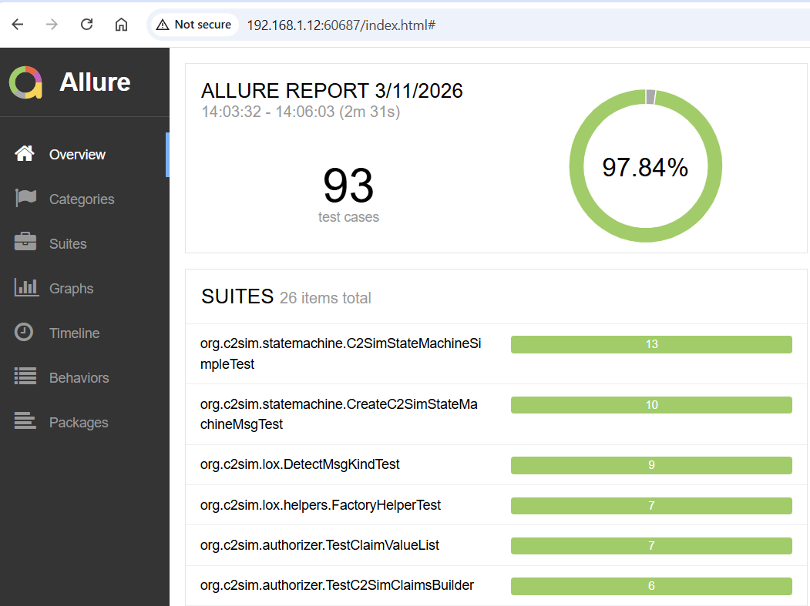
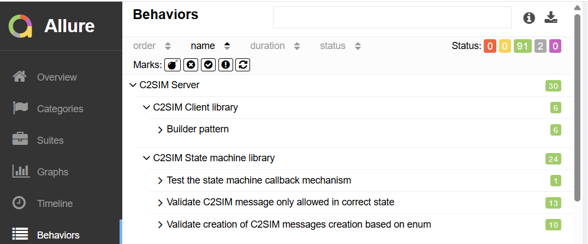

# Allure framework

[Allure Report](https://github.com/allure-framework) is a test reporting tool that turns raw test results into clear, visual, interactive reports.

Allure is integrated in the maven phase `test` and `verify`. 

## Generate allure website

The `junit tests` generate `xml test result reports`, with `allure:report` a website is generated based on these reports.

```
# Run junit test
mvn test
# Convert the generated junit xml report to a website
mvn allure:report 
```

## Show JUNIT reports

```
mvn allure:serve
```

!!! info

    This will start a local webserver on a free port, and opens a browser with the allure page.



Multiple views on the unit tests:


