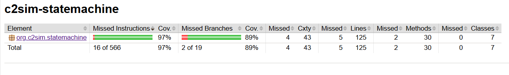
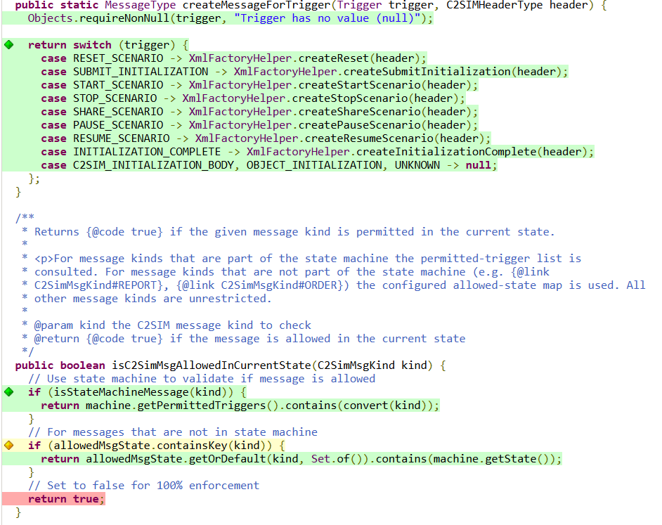

# Code coverage for unit tests

[JaCoCo](https://www.eclemma.org/jacoco/) (Java Code Coverage) is a free and open-source library maintained by the Eclipse Foundation that measures how much of the Java code is executed during tests.

JaCoCo instruments the code at runtime using a Java agent, integrates with the Maven build tool, and generates reports showing line and branch coverage.

## Jacoco maven plugin

The [jacoco-maven-plugin](https://www.eclemma.org/jacoco/trunk/doc/maven.html) is used to add code coverage analysis to the test phase of the build. 

The plugin configuration is defined in the aggregator POM (pom.xml), where the `jacoco-maven-plugin` is configured for the project.

The secition `<phase>verify</phase>` defines in which phase the report is generated.

## Running Jacoco

JaCoCo is bound to the Maven test phase. When the following command is executed, JaCoCo automatically attaches its coverage agent:

```
mvn clean test
```

JaCoCo will:

1. Attach the coverage agent

2. Run tests

3. Generate a coverage report

!! note

    In the pom.xml, generated code (such as XSD and OpenAPI generated classes) is excluded from the code coverage analysis.
    This is because the generated code is assumed to be tested by the tools that produced it.

To explicitly generate the coverage report, run:

```
mvn jacoco:report
```

## View report

A coverage report is generated for each module at: `target/site/jacoco/index.html`. 

Open this file in a browser to view the report.

It contains:

- Line coverage

- Branch coverage

- Missed instructions

- Per-class coverage

Each module also contains a file `target/jacoco.exec`, this contains the binary data of the code analyses, which JaCoCo uses to generate the final reports.

## Coverage for module example.



### Coverage per class example

* Green = code covered in unit test
* Yellow = tested, but not all combinations
* Red = not tested in unit code
  

A coverage of 70-80% is acceptable for standard projects.
